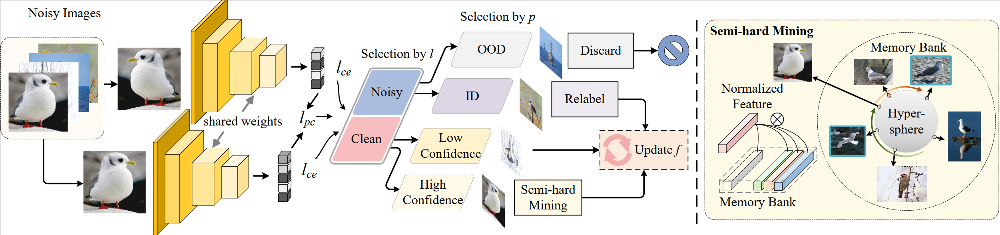
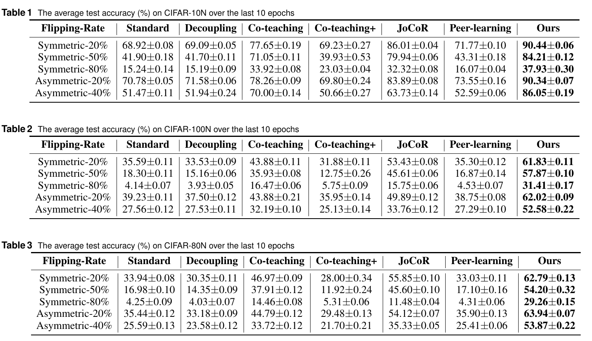
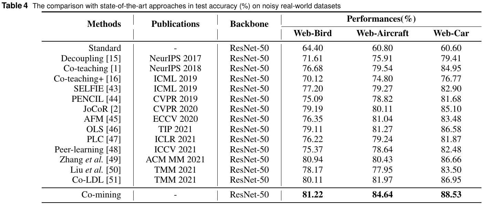

# Co-mining: Mining Informative Samples with Noisy Labels
## Introduction
This is the PyTorch implementation for our paper **Co-mining: Mining Informative Samples with Noisy Labels**

## Network Architecture
The architecture of our proposed approach is as follows


## Environment
Create a virtual environment with python 3.7,

    $  conda create -n comining_env python=3.7

    $  conda activate comining_env

  Install all dependencies

    $  pip install -r requirements.txt
    
   
## Data Preparation
Create a folder `datasets` and download `cifar10`/`cifar100`/[`web-bird`](https://wsnfg-sh.oss-cn-shanghai.aliyuncs.com/web-bird.tar.gz), [`web-car`](https://wsnfg-sh.oss-cn-shanghai.aliyuncs.com/web-car.tar.gz)/[`web-aircraft`](https://wsnfg-sh.oss-cn-shanghai.aliyuncs.com/web-aircraft.tar.gz) into this folder.

  ```
  ---datasets
     ├── web-bird
     │   ├── train
     │   └── val
     ├── web-car
     │   ├── train
     │   └── val
     └── web-aircraft
     |   ├── train
     |   └── tval
     ├── cifar10
     |   └── cifar-10-batches-py
     └── cifar100
         └── cifar-100-python 
  ```
  
## Training
- We provide a demo `example.sh`. You can modify GPU device in the `example.sh` and use the default setting. Then directly run

```python
bash example.sh
```

- If you want to train the whole model with other settings, modify the corresponding parameters and run

```python
CUDA_VISIBLE_DEVICES=0  python cifarmain.py --synthetic-data cifar10nc  --dataset cifar10  --noise-type symmetric  --closeset_ratio 0.2  --method  comining
```

```python
CUDA_VISIBLE_DEVICES=0  python cifarmain.py --synthetic-data cifar100nc  --dataset cifar100  --noise-type symmetric  --closeset_ratio 0.5  --method  comining
```

```python
CUDA_VISIBLE_DEVICES=0  python cifarmain.py --synthetic-data cifar80no  --dataset cifar100  --noise-type asymmetric  --closeset_ratio 0.4  --method  comining
```

```python
CUDA_VISIBLE_DEVICES=0  python webmain.py  --dataset web-bird  --w_pc 0.3  --w_tri 3  --w_re 0.01  --m 0.4 
```

## Results
The final experimental results are shown in the following table：



  
